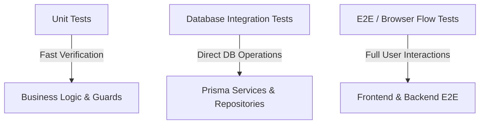

# TDD Infrastructure Guide - Phase 1 MVP

This document describes the testing infrastructure, strategies, database integration patterns, mocking strategies, and setup requirements for the **Saarthi Cherp** test suite. It serves as a contract for contributors to write and execute tests.

---

## 1. Test Architecture Overview

Saarthi Cherp implements a layered Test-Driven Development (TDD) model. This ensures both unit-level business logic correctness and data integrity across database transactions.



### 1.1 Test Categories
1. **Unit Tests**: Test logic isolated from the network and database. High-frequency execution.
2. **Database Integration Tests**: Run directly against the live Supabase/PostgreSQL database to verify transactional safety, constraint integrity, and database-level calculations (e.g., completion percentage recalculations, cascade triggers, designations-based stakeholder notifications).
3. **E2E/Browser Tests (Selenium)**: Test user interface interactions, validation modals, loading states, and state synchronizations.

---

## 2. Test File Locations

All test-related scripts and fixtures are organized as follows:

```txt
cherp/
├── backend/
│   ├── src/                    # App source code
│   └── scripts/                # Database Integration Test Scripts
│       ├── stage3-ai-chat-db.test.ts   # Chatbot E2E & DB persistence test
│       ├── user-data-flow-db.test.ts   # Client Onboarding & Blocker rollback test
│       ├── measure-phase1-performance.ts # Performance & N+1 query latency monitor
│       └── ...
├── selenium-e2e/               # UI E2E browser flows
│   ├── test/                   # Selenium test suites
│   ├── package.json
│   └── ...
└── docs/current/               # Generated execution test reports
    ├── chatbot_test_report.md  # Output from stage3-ai-chat-db run
    └── user_dataflow_test_report.md # Output from user-data-flow-db run
```

---

## 3. Database Integration Testing Protocol

Database integration tests run directly on the development/staging Supabase PostgreSQL instance using Prisma Client.

### 3.1 Rules of Database Interactions
> [!IMPORTANT]
> **No Orphan Records**: Tests must clean up after themselves. All objects created during a test (tenants, scope templates, clients, workflows, tasks, blockers, notifications) must be purged in a `finally` block or a dedicated teardown sequence to prevent cluttering the database.
>
> **Designation Restorations**: If a test temporarily modifies user fields (such as changing a user's designation to `'Account Manager'` to test stakeholder notifications), the original values must be cached and restored during teardown.
>
> **Respecting Foreign Key Constraints**: The `users` table contains a foreign key referencing the Supabase `auth.users` schema. Thus, tests should never insert fake users with random IDs. Instead, tests query the database for existing seeded E2E users.

### 3.2 Dynamic Test Isolation
To avoid collisions with other running tests or seed data, dynamic parameters should be generated for each test run:
- **Clients**: Append a timestamp to the client name (e.g., `Acme Chatbot Client ${Date.now()}`).
- **Scope Templates**: Create a unique scope template for each run using a randomized industry and service type:
  ```typescript
  const testIndustry = `SaaS-${Date.now()}`;
  const testServiceType = `PPC-${Date.now()}`;
  ```
  This satisfies the unique constraint `@@unique([tenant_id, industry, service_type])` and keeps tests isolated.

---

## 4. Mocking Conventions

### 4.1 Mocking Fetch & External APIs
When testing components that make HTTP calls (such as the AI Chatbot interacting with Gemini LLM), tests intercept the native Node.js global `fetch` API.

**Example Mocking Pattern:**
```typescript
global.fetch = async (url: any, init?: any) => {
  const responseText = JSON.stringify({
    candidates: [{
      content: {
        parts: [{
          text: JSON.stringify({
            execute: 'create_task',
            params: {
              taskTitle: 'Launch Campaign Banner',
              assigneeName: 'E2E Team Member',
              brandName: 'Acme Brand',
              dueDate: new Date().toISOString(),
            },
            response: 'AI successfully scheduled your task creation in the database.',
          }),
        }],
      },
    }],
  });
  return {
    ok: true,
    statusText: 'OK',
    json: async () => JSON.parse(responseText),
    text: async () => responseText,
  } as any;
};
```

---

## 5. Execution Reference & Commands

Run database integration tests from the `backend/` directory:

```bash
# Run AI Chatbot DB integration test
cmd.exe /c npx ts-node scripts/stage3-ai-chat-db.test.ts

# Run UserFlow/Dataflow integration test
cmd.exe /c npx ts-node scripts/user-data-flow-db.test.ts

# Run latency performance analysis
cmd.exe /c npx ts-node scripts/measure-phase1-performance.ts
```

*Note: On Windows, use `cmd.exe /c` to bypass PowerShell script execution policy locks.*

---

## 6. Report Generation Pipeline

Every database integration test script is responsible for appending execution details to a local log buffer and writing a Markdown report inside `docs/current/`.

### 6.1 Report Artifact Specs
Reports must contain:
1. **Metadata**: Status (`PASS`/`FAIL`), Timestamp, Target Database.
2. **Log Output**: Detailed, chronological execution logs representing queries and asserts.
3. **Verification Checks**: A checklist (e.g. `- [x]`) representing verified criteria.
