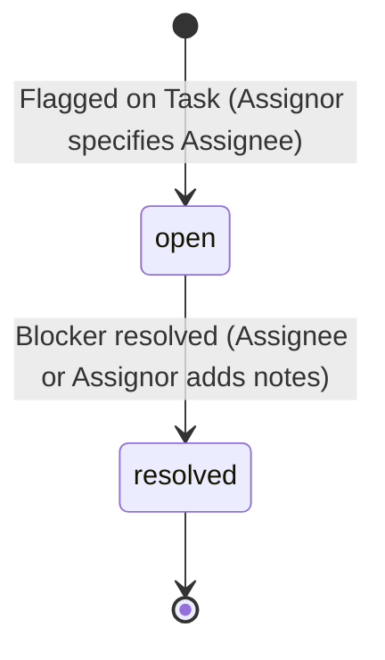
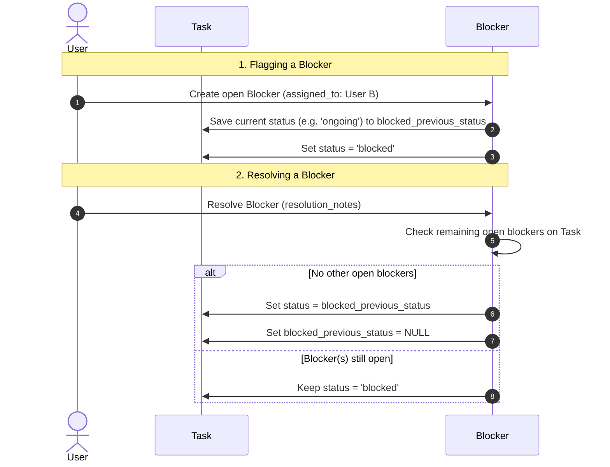

# Blocker Lifecycle & Management Specification

This document defines the lifecycle, workflow transitions, database mappings, and access controls for operational **Blockers** within the Agency Command Center ERP.

---

## 1. Blocker States & Lifecycle

A blocker represents an impediment on a task that halts delivery. Blockers progress through a simple, strict lifecycle:



### A. Operational States
- **Open**: The blocker is actively stopping task execution. The parent task's status is forced to `blocked`.
- **Resolved**: The blocker has been addressed and documented. The parent task is released from `blocked` status.

---

## 2. Roles and Ownership Boundaries

Every blocker involves three user roles:
1.  **Assignor (Flagged By)**: The user who identified the blocker, created it in the system, and assigned it to a team member to fix.
2.  **Assignee (Assigned To)**: The user responsible for resolving the impediment.
3.  **Resolver (Resolved By)**: The user who resolved the blocker.

### A. Access Control Matrix for Blocker Operations

| Role | Create Blocker | View Blocker | Resolve Blocker |
|---|---|---|---|
| **Super Admin** | Yes (Any task) | Yes (All) | Yes (All) |
| **Project Manager** | Yes (Any task in client) | Yes (Client-scoped) | Yes (Client-scoped) |
| **Team Member** | Yes (Assigned tasks only) | Yes (Client-scoped) | Yes (If Assignee OR Assignor of the Blocker) |
| **Client** | No | Yes (Read-only status) | No |

---

## 3. Task Status Restoration Logic

To prevent tasks from getting stuck in `'blocked'` status or reverting to an incorrect status, we implement a state-restoring transaction pipeline:



### A. State Rollback Rules
- When a task is blocked for the *first* time (i.e. no other open blockers exist), the task's current status (e.g., `'yet_to_start'`, `'ongoing'`, `'rework'`) is stored in `blocked_previous_status`.
- If a *second* blocker is logged while the task is already `'blocked'`, the `blocked_previous_status` is **not** overwritten.
- When resolving a blocker, if it is the *last* open blocker on that task, the task's status is reverted to `blocked_previous_status` (defaulting to `'ongoing'` if it was somehow null), and `blocked_previous_status` is reset to `null`.

---

## 4. Database Schema Mapping

```sql
-- erp.blockers table mapping
CREATE TABLE erp.blockers (
    id uuid PRIMARY KEY DEFAULT gen_random_uuid(),
    tenant_id uuid NOT NULL REFERENCES erp.tenants(id),
    task_id uuid NOT NULL REFERENCES erp.tasks(id) ON DELETE CASCADE,
    client_id uuid NOT NULL REFERENCES erp.clients(id) ON DELETE CASCADE,
    flagged_by uuid NOT NULL REFERENCES erp.users(id),
    assigned_to uuid NOT NULL REFERENCES erp.users(id), -- Required
    resolved_by uuid REFERENCES erp.users(id),
    title text NOT NULL,
    description text,
    severity varchar(20) NOT NULL DEFAULT 'medium',
    status varchar(20) NOT NULL DEFAULT 'open',
    impact text,
    resolution_notes text,
    flagged_at timestamptz NOT NULL DEFAULT now(),
    resolved_at timestamptz,
    created_at timestamptz NOT NULL DEFAULT now(),
    updated_at timestamptz NOT NULL DEFAULT now()
);

-- erp.tasks table addition
ALTER TABLE erp.tasks ADD COLUMN IF NOT EXISTS blocked_previous_status varchar(50);
```
