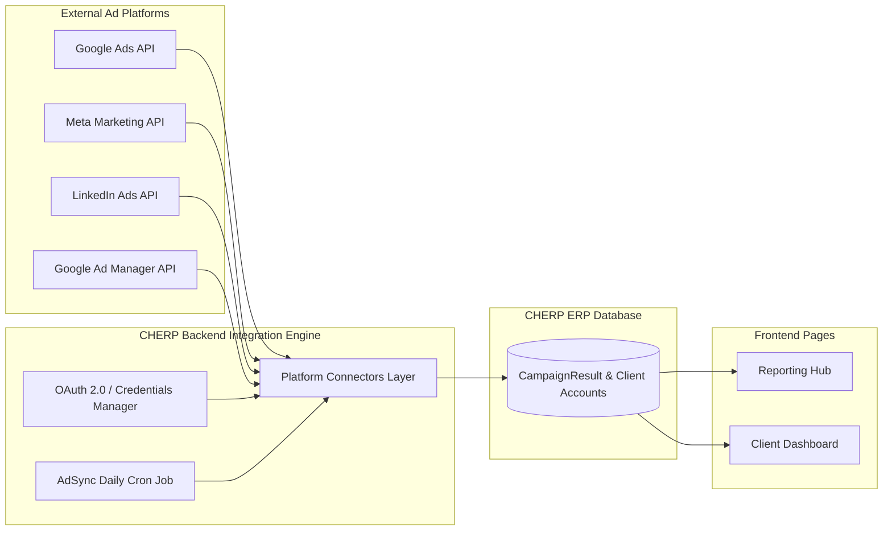
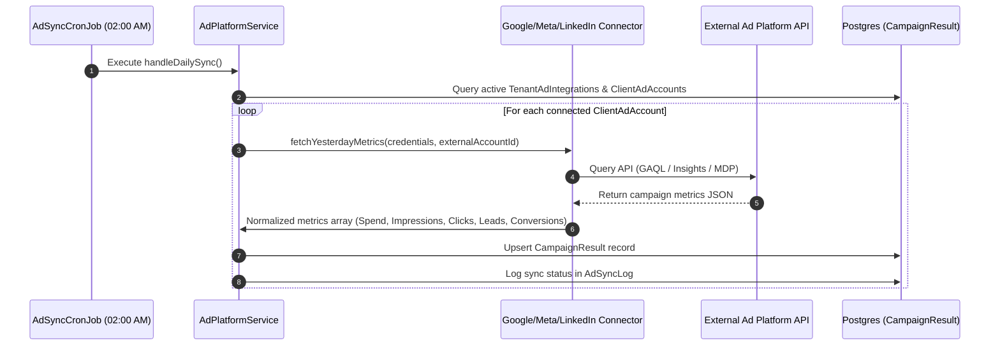

# CHERP ERP — Ad Platform Integration Specification & Architecture Guide

**Document type:** Architecture & Technical Specification  
**Project:** CHERP / Agency Command Center ERP  
**Module:** Ad Platform Automated Data Pipeline (Phase 3 Integration Specification)  
**Target Platforms:** Google Ads, Meta Ads Manager, LinkedIn Ads, Google Ad Manager (GAM)  
**Target Architecture:** OAuth 2.0 + REST/gRPC Connectors + Cron Sync Pipeline + Tenant Security Layer  

---

## 1. Executive Summary & Overview

Currently, CHERP ERP supports **manual campaign results entry** and **manual content performance logging** inside the Reporting Hub.

This specification details the end-to-end technical plan to integrate external advertising platforms directly into CHERP. Once implemented, agency teams will no longer need to enter PPC campaign spend, impressions, clicks, leads, or conversions manually. Instead, CHERP will fetch daily performance metrics automatically via official platform APIs (Google Ads API, Meta Marketing API, LinkedIn Marketing API, and Google Ad Manager API), map them to CHERP clients, and populate the Reporting Hub.



---

## 2. Cloud Console & OAuth Configuration Setup

### 2.1 Google Cloud Console Setup (Google Ads API & Google Ad Manager API)

To enable Google Ads and Google Ad Manager integrations, the agency/developer must configure Google Cloud Platform (GCP) and Google Ads Manager Accounts.

#### GCP Project Setup
1. Log in to [Google Cloud Console](https://console.cloud.google.com/).
2. Create a project named `CHERP Agency ERP Engine`.
3. Enable the following APIs under **APIs & Services**:
   - `Google Ads API`
   - `Google Ad Manager API` (formerly DFP API)
   - `Google OAuth2 API`

#### OAuth 2.0 Credentials
1. Configure the **OAuth Consent Screen** (User type: External, Publish Status: Production/Testing).
2. Add Scopes:
   - `https://www.googleapis.com/auth/adwords` (Google Ads API access)
   - `https://www.googleapis.com/auth/dfp` (Google Ad Manager API access)
3. Create **OAuth 2.0 Client ID** (Application type: Web application).
   - **Authorized JavaScript origins:** `https://app.cherp-erp.com`
   - **Authorized redirect URIs:** `https://api.cherp-erp.com/api/ad-platform/callback/google`

#### Google Ads Developer Token
1. Log in to the agency **Google Ads Manager Account (MCC)**.
2. Navigate to **Tools & Settings → API Center**.
3. Apply for a **Developer Token**.
   - *Test Access / Basic Access* allows sandbox and production account querying.
   - Store Developer Token securely in tenant integration settings.

#### Google Ad Manager Service Account (GAM)
1. In Google Cloud Console, navigate to **IAM & Admin → Service Accounts**.
2. Create a Service Account `cherp-gam-service@project.iam.gserviceaccount.com`.
3. Generate a JSON Key file.
4. In Google Ad Manager Admin Console, add the Service Account email as a user with **Trafficker** or **Read-Only Reporting** permissions.

---

### 2.2 Meta for Developers Setup (Meta / Facebook Ads Manager)

To fetch Meta Ads (Facebook & Instagram) metrics:

#### Meta Developer App Setup
1. Log in to [Meta for Developers](https://developers.facebook.com/).
2. Create an App with type **Business**.
3. App Name: `CHERP ERP Ad Ingestion`.
4. Add Products:
   - **Marketing API**
   - **Webhooks**

#### OAuth & Permissions
1. Under **Settings → Basic**, copy **App ID** and **App Secret**.
2. Set **Valid OAuth Redirect URIs**: `https://api.cherp-erp.com/api/ad-platform/callback/meta`
3. Request App Review permissions for:
   - `ads_read` (Read ad account performance data)
   - `ads_management` (Optional: adjust budgets / pause campaigns)
   - `read_insights` (Access ad set and ad campaign analytics)

---

### 2.3 LinkedIn Developers Setup (LinkedIn Ads)

To fetch LinkedIn Sponsored Content & Lead Gen Form performance:

1. Log in to [LinkedIn Developer Portal](https://www.linkedin.com/developers/).
2. Create an App `CHERP ERP Analytics`.
3. Associate App with Agency LinkedIn Page.
4. Add Product: **Marketing Developer Platform (MDP)**.
5. In **Auth Settings**, configure Redirect URL: `https://api.cherp-erp.com/api/ad-platform/callback/linkedin`.
6. Request Scopes:
   - `r_ads` (Read ad accounts)
   - `r_ads_reporting` (Read ad reporting & insights metrics)

---

## 3. Database Schema Extensions (Prisma Models)

Add the following 3 models to `backend/prisma/schema.prisma` under the `erp` schema:

```prisma
// Tenant-level Ad Platform Credentials and OAuth Tokens
model TenantAdIntegration {
  id                   String    @id @default(uuid()) @db.Uuid
  tenant_id            String    @db.Uuid
  platform             String    // 'google_ads', 'meta_ads', 'linkedin_ads', 'google_ad_manager'
  is_enabled           Boolean   @default(true)
  client_id            String?
  client_secret        String?   // Encrypted at rest using AES-256
  developer_token      String?   // Encrypted at rest (Google Ads)
  access_token         String?   // Encrypted at rest
  refresh_token        String?   // Encrypted at rest
  token_expires_at     DateTime? @db.Timestamptz
  account_id           String?   // Agency MCC ID / Business Manager ID
  service_account_json Json?     // Encrypted JSON key for GAM service account
  created_at           DateTime  @default(now()) @db.Timestamptz
  updated_at           DateTime  @updatedAt @db.Timestamptz

  tenant Tenant @relation(fields: [tenant_id], references: [id])

  @@unique([tenant_id, platform])
  @@map("tenant_ad_integrations")
  @@schema("erp")
}

// Client-to-External-Ad-Account Linkage Mapping
model ClientAdAccount {
  id                  String   @id @default(uuid()) @db.Uuid
  tenant_id           String   @db.Uuid
  client_id           String   @db.Uuid
  platform            String   // 'google_ads', 'meta_ads', 'linkedin_ads', 'google_ad_manager'
  external_account_id String   // e.g., "123-456-7890" for Google Ads, "act_10158..." for Meta
  account_name        String
  currency            String   @default("INR")
  is_active           Boolean  @default(true)
  created_at          DateTime @default(now()) @db.Timestamptz
  updated_at          DateTime @updatedAt @db.Timestamptz

  tenant Tenant @relation(fields: [tenant_id], references: [id])
  client Client @relation(fields: [client_id], references: [id])

  @@unique([tenant_id, client_id, platform, external_account_id])
  @@index([tenant_id, platform])
  @@map("client_ad_accounts")
  @@schema("erp")
}

// Execution Logs for Automated Data Ingestion Jobs
model AdSyncLog {
  id             String    @id @default(uuid()) @db.Uuid
  tenant_id      String    @db.Uuid
  platform       String
  account_id     String
  sync_type      String    // 'scheduled_daily', 'manual_trigger'
  status         String    // 'success', 'failed', 'partial'
  records_synced Int       @default(0)
  error_message  String?
  started_at     DateTime  @default(now()) @db.Timestamptz
  completed_at   DateTime? @db.Timestamptz

  tenant Tenant @relation(fields: [tenant_id], references: [id])

  @@index([tenant_id, platform, started_at])
  @@map("ad_sync_logs")
  @@schema("erp")
}
```

---

## 4. Backend Module Architecture & API Specifications

Create backend directory `backend/src/ad-platform/`:

```text
backend/src/ad-platform/
├── ad-platform.module.ts
├── ad-platform.controller.ts
├── ad-platform.service.ts
├── crypto.util.ts
├── connectors/
│   ├── google-ads.connector.ts
│   ├── meta-ads.connector.ts
│   ├── linkedin-ads.connector.ts
│   └── google-ad-manager.connector.ts
├── scheduler/
│   └── ad-sync-cron.job.ts
└── dto/
    ├── save-credentials.dto.ts
    ├── link-account.dto.ts
    └── trigger-sync.dto.ts
```

### 4.1 REST API Specifications

#### `POST /api/ad-platform/credentials`
Saves or updates OAuth credentials / API tokens for a tenant.

**Request Body:**
```json
{
  "platform": "google_ads",
  "client_id": "9876543210-xxxx.apps.googleusercontent.com",
  "client_secret": "GOCSPX-xxxx",
  "developer_token": "DEV_TOKEN_KEY_123",
  "account_id": "123-456-7890"
}
```

#### `GET /api/ad-platform/oauth/:platform`
Returns OAuth Authorization URL to initiate user login and consent flow.

**Response:**
```json
{
  "auth_url": "https://accounts.google.com/o/oauth2/v2/auth?client_id=...&redirect_uri=..."
}
```

#### `GET /api/ad-platform/callback/:platform?code=...`
Receives OAuth authorization code from platform redirect, exchanges it for access + refresh token, and saves encrypted refresh token.

#### `GET /api/ad-platform/accounts/:platform`
Lists all external ad accounts available under the agency's connected credentials.

**Response:**
```json
{
  "platform": "meta_ads",
  "accounts": [
    { "external_account_id": "act_1015888", "account_name": "Acme Real Estate Meta Ads", "currency": "INR" },
    { "external_account_id": "act_2024999", "account_name": "HealthCare Lead Gen Meta", "currency": "INR" }
  ]
}
```

#### `POST /api/ad-platform/link-account`
Links an external ad account to a CHERP client record.

**Request Body:**
```json
{
  "client_id": "client-uuid-here",
  "platform": "google_ads",
  "external_account_id": "123-456-7890",
  "account_name": "Acme Google Ads Search"
}
```

#### `POST /api/ad-platform/sync`
Triggers immediate manual sync for a client or tenant.

---

## 5. Daily Data Ingestion Pipeline & Scheduler Workflow



### Campaign Metrics Mapping Standard

When connectors ingest platform data, they normalize fields into CHERP's `CampaignResult` schema:

| External Metric | CHERP Field | Conversion / Calculation Rule |
| :--- | :--- | :--- |
| `cost_micros` / `spend` | `ad_spend` | Convert micros (`cost / 1,000,000`) or direct currency value |
| `impressions` | `impressions` | Direct integer |
| `clicks` | `clicks` | Direct integer |
| `conversions` / `leads` | `leads` / `conversions` | Map lead forms to `leads`, purchase/goals to `conversions` |
| `conversions_value` / `revenue` | `revenue` | Direct decimal value |
| — | `cpl` | Auto-calculated: `ad_spend / leads` |
| — | `roas` | Auto-calculated: `revenue / ad_spend` |

---

## 6. Security, Encryption & Token Management

1. **AES-256-GCM Encryption**: All sensitive tokens (`client_secret`, `developer_token`, `access_token`, `refresh_token`, `service_account_json`) MUST be encrypted using `crypto.util.ts` before writing to Postgres.
2. **Automatic Refresh Token Exchange**: When fetching API metrics, if `token_expires_at` is within 5 minutes, `AdPlatformService` automatically uses `refresh_token` to request a fresh `access_token`.
3. **Tenant Isolation**: Queries strictly enforce `where: { tenant_id: user.tenantId }`.

---

## 7. Integration Roadmap & Implementation Checklist

```text
Phase 3.1: Security & Database Setup
 [ ] Add TenantAdIntegration, ClientAdAccount, AdSyncLog to schema.prisma
 [ ] Run npx prisma migrate dev --name add_ad_platform_integrations
 [ ] Implement crypto.util.ts (AES-256-GCM encrypt/decrypt helpers)

Phase 3.2: Platform Connectors Implementation
 [ ] Create google-ads.connector.ts (Google Ads Search & Display queries)
 [ ] Create meta-ads.connector.ts (Meta Marketing Graph API query)
 [ ] Create linkedin-ads.connector.ts (LinkedIn MDP Analytics API query)
 [ ] Create google-ad-manager.connector.ts (GAM DFP Service Account reporting)

Phase 3.3: OAuth Controllers & Frontend Integrations Tab
 [ ] Implement AdPlatformController OAuth endpoints & callbacks
 [ ] Build Integrations Page UI (/integrations) with OAuth Connect buttons
 [ ] Build Account Linkage Modal for mapping client records to ad accounts

Phase 3.4: Automated Sync Cron & Verification
 [ ] Implement AdSyncCronJob running daily at 02:00 AM
 [ ] Verify automatic ingestion into CampaignResult table
 [ ] Verify Reporting Hub updates automatically with synched metrics
```


Here’s the task list for **today — 01 September 2026**.

## CHERP / ERP Work

### 1. Railway Deployment Planning

- Confirmed that CHERP should be deployed as **two separate Railway services**:
    
    - Frontend root: `/frontend`
        
    - Backend root: `/backend`
        
- Confirmed that backend should **not** be hosted from `/src` or `/backend/src`.
    
- Wrote the Railway deployment approach for both frontend and backend.
    
- Clarified Railway build/start setup for:
    
    - Vite frontend
        
    - NestJS backend
        
    - Supabase env vars
        
    - API base URL
        
    - CORS `FRONTEND_ORIGIN`
        

### 2. Frontend Railway Build Debugging

- Diagnosed the `/frontend` Railway build failure.
    
- Found that Railway correctly detected the frontend as a **Vite static site**.
    
- Identified frontend build blockers:
    
    - Missing `zod` dependency
        
    - Strict TypeScript unused import errors
        
    - ReportingHub type issues
        
    - Invalid `apiClient.getBlob` usage
        
- Clarified that dependencies must be committed in `package.json` / lockfile so Railway installs them during deployment.
    
- Explained that installing locally is only a way to correctly update dependency files, not because Railway depends on the local system.
    

### 3. Backend Railway Build Debugging

- Diagnosed the backend pnpm error:
    

```txt
ERROR  packages field missing or empty
```

- Confirmed the backend root should remain `/backend`.
    
- Identified the cause as `backend/pnpm-workspace.yaml`.
    
- Avoided risky deletion after your concern.
    
- Suggested the safer fix: keep `pnpm-workspace.yaml`, but make it valid with:
    

```yaml
packages:
  - "."
```

### 4. Backend TypeScript Build Debugging

- Diagnosed the new backend build error involving:
    

```txt
src/scripts/remove-e2e-users.ts
src/scripts/seed-role-accounts.ts
src/scripts/test-client-creation-with-team.ts
```

- Confirmed these seed/test/e2e scripts are **not required for production deployment**.
    
- Recommended the safer fix: exclude `src/scripts` from production TypeScript build instead of installing `dotenv`.
    
- Prepared the corrected `backend/tsconfig.build.json` approach:
    

```json
{
  "extends": "./tsconfig.json",
  "exclude": [
    "node_modules",
    "dist",
    "scripts",
    "src/scripts",
    "src/**/*.spec.ts",
    "**/*.spec.ts"
  ]
}
```

- Wrote a safe prompt for an AI/dev agent to apply only that narrow fix.
    

---

## GitHub / Branch / Push Work

### 5. GitHub Push Access Setup

- Discussed how to push to a GitHub repo owned under another account/org while using your `Akshais97` account.
    
- Clarified that collaborator access allows direct push without forking.
    
- Explained how to push your existing ZIP-based work without losing changes.
    
- Discussed the “entirely different commit histories” issue.
    
- Clarified that the PR/base branch should generally be `main` when comparing your custom branch against the repo’s main branch.
    

---

## CHERP Planning / Implementation Review

### 6. Phase 2 / Beyond Phase 2 Planning

- Reviewed the CHERP implementation context against the PRD/implementation plan.
    
- Discussed what is pending till Phase 2.
    
- Looked at work involving:
    
    - Task model
        
    - Sub-checklists/subtasks
        
    - Time tracking
        
    - Scheduler jobs
        
    - Notification preferences
        
    - Tenant and tenant-user support
        
    - Client portal/reporting/onboarding items
        

### 7. Latency Optimization Prompt

- Wrote a detailed AI-agent prompt to investigate and fix live application latency.
    
- Included reasoning keywords and methods:
    
    - First-principles thinking
        
    - RCA
        
    - Deep-dive thinking
        
    - Second-order thinking
        
    - Multiple optimization passes
        
- Target repo: `https://github.com/Akshais97/cherp`
    

---

## Resend / Domain / Email Setup

### 8. Resend DNS / Domain Configuration

- Worked through Resend domain verification details for:
    

```txt
mail.crm.sakhaa.ai
```

- Reviewed DNS records such as:
    
    - DKIM TXT record
        
    - SPF/MX-related record
        
    - DNS names/values/TTL
        
- Resend integration will be done tomorrow.
    

---

    

### 10. Safe-Fix Prompting

- Converted the backend Railway TypeScript fix into a clear prompt for a dev/AI agent.
    
- Added strict constraints:
    
    - Safe fixes only
        
    - Do not change Railway root directory
        
    - Do not switch package managers
        
    - Do not edit lockfiles unnecessarily
        
    - Do not install `dotenv` just for seed/test scripts
        
    - Exclude `src/scripts` from production build
        

---

## Summary

Today’s main work was around **getting CHERP deployable on Railway**, especially debugging frontend and backend build failures safely. Secondary work included **GitHub push/access handling**, **CHERP planning beyond Phase 2**, **latency optimization prompting**, and **Resend domain/DNS setup communication**.

Ran command: `git log -n 15 --oneline`
Ran command: `git log -n 10 --format="%h %ad %s" --date=iso`

Here is a comprehensive summary of all the tasks, fixes, and features completed today (**September 1, 2026**):

---

### 🚀 1. Production Latency RCA & Performance Optimization
- **Deep-Dive RCA & Infrastructure Telemetry Audit**: 
  - Investigated the latency gap between local execution ($\sim 1.04\text{s}$) and live Railway + Supabase deployment ($\sim 7.78\text{s}$).
  - Authored comprehensive RCA documentation ([`production_latency_rca_2026-09-01.md`](file:///d:/Chlear%20Projects/Marketerp/cherp/docs/current/production_latency_rca_2026-09-01.md)).
- **Backend Auth Lookup In-Memory Cache**:
  - Updated [`jwt-auth.guard.ts`](file:///d:/Chlear%20Projects/Marketerp/cherp/backend/src/common/guards/jwt-auth.guard.ts) with an in-memory 30-second TTL cache (`getErpUserCached`) for resolved ERP user records, eliminating redundant database queries on 100% of API requests.
- **Consolidated Dashboard Endpoint**:
  - Implemented `GET /api/dashboard/overview` in [`dashboard.controller.ts`](file:///d:/Chlear%20Projects/Marketerp/cherp/backend/src/dashboard/dashboard.controller.ts) & [`dashboard.service.ts`](file:///d:/Chlear%20Projects/Marketerp/cherp/backend/src/dashboard/dashboard.service.ts).
  - Updated frontend [`api.ts`](file:///d:/Chlear%20Projects/Marketerp/cherp/frontend/src/features/dashboard/api.ts) & [`DashboardPage.tsx`](file:///d:/Chlear%20Projects/Marketerp/cherp/frontend/src/features/dashboard/DashboardPage.tsx) to fetch summary, client health, deadlines, and blockers in a **single server-side `Promise.all` HTTP call** instead of 4 separate requests.
- **HTTP Gzip Response Compression**:
  - Installed `compression` package and enabled Express gzip compression middleware in NestJS ([`main.ts`](file:///d:/Chlear%20Projects/Marketerp/cherp/backend/src/main.ts)) to shrink raw JSON network payloads by 80–90%.
- **Notification Polling Saturation Fix**:
  - Updated [`NotificationsBell.tsx`](file:///d:/Chlear%20Projects/Marketerp/cherp/frontend/src/features/notifications/NotificationsBell.tsx) to change `refetchInterval` from 5 seconds (5000ms) to 60 seconds (60000ms), stopping connection pool flooding.
- **Database Schema Indexes**:
  - Added indexes in [`schema.prisma`](file:///d:/Chlear%20Projects/Marketerp/cherp/prisma/schema.prisma) for `Task` (`tenant_id, client_id`, `tenant_id, parent_task_id`), `TaskAttachment`, `TimeEntry`, `Notification`, and `ActivityLog`.
  - Generated Prisma Client (`npx prisma generate`) and created production DDL script [`production_latency_indexes.sql`](file:///d:/Chlear%20Projects/Marketerp/cherp/prisma/production_latency_indexes.sql).

---

### 🛠️ 2. Scope Templates & Onboarding Fixes
- **Scope Templates HTTP 400 Resolution**:
  - Updated scope templates logic to check for existing templates before seeding and safely handle foreign key relations without throwing validation errors.

---

### 🎨 3. PPC Module & Reporting Hub UI Enhancements
- **PPC Integration**:
  - Built and integrated the new PPC Module workflows.
- **Reporting Hub UI Fixes**:
  - Updated icon usage to `ChartBarTrendUp` for Reporting Hub.
  - Fixed section collapsing bug in System & Security settings ([`AppShell.tsx`](file:///d:/Chlear%20Projects/Marketerp/cherp/frontend/src/components/layout/AppShell.tsx)).

---

### 🔐 4. CORS & Deployment Configuration
- **Strict CORS Origin Matching**:
  - Updated [`main.ts`](file:///d:/Chlear%20Projects/Marketerp/cherp/backend/src/main.ts) to enforce exact-match origin validation for CORS security.
  - Dynamically configured Railway production origin (`https://cherp-production.up.railway.app`).
- **Build Pipeline Scripting**:
  - Added `prisma generate` to `postinstall` and `build` scripts in [`backend/package.json`](file:///d:/Chlear%20Projects/Marketerp/cherp/backend/package.json).

---

### 🧹 5. Tooling & Workspace Maintenance
- **TypeScript & Build Configs**:
  - Resolved NestJS build issues in `backend/tsconfig.build.json` and workspace settings (`pnpm-workspace.yaml`).
- **Dependencies**:
  - Added `zod` dependency for runtime schema validation.
  - Cleaned up invalid backend files and build artifacts.